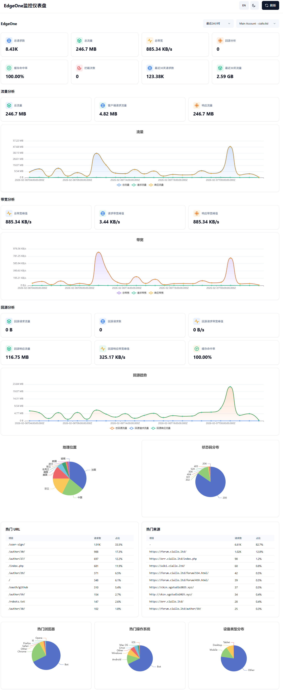

<div align="center">

# Unified Monitor - Cloudflare & EdgeOne & 阿里云 ESA 统一监控仪表盘

  

[](LICENSE)
[](https://hub.docker.com/r/lingmowen/cdn-analytics-dashboard)
[](https://nodejs.org/)

一个统一的监控仪表盘，支持同时监控 Cloudflare、EdgeOne 和阿里云 ESA 多个 CDN 平台的流量数据。

</div>

## 预览



##  功能特性

### 核心功能

- ✅ **多平台支持**: 同时支持 Cloudflare、EdgeOne 和阿里云 ESA
- ✅ **统一仪表盘**: 在一个界面查看所有平台数据
- ✅ **平台切换**: 快速切换不同平台视图
- ✅ **数据对比**: 对比不同平台的数据指标
- ✅ **多账户支持**: 支持多个 Cloudflare 和 EdgeOne 账户
- ✅ **多 Zone 监控**: 支持监控多个 Zone
- ✅ **实时数据**: EdgeOne 实时数据查询
- ✅ **历史数据**: Cloudflare 历史数据分析（1/3/7/30 天）
- ✅ **多维度分析**: 流量、带宽、请求数、威胁数等
- ✅ **地理位置**: 显示访问来源国家/地区排行
- ✅ **缓存分析**: 缓存命中率和缓存流量统计
- ✅ **回源分析**: EdgeOne 回源流量、带宽、请求数
- ✅ **Pages 统计**: EdgeOne Pages 构建次数和云函数请求
- ✅ **多语言支持**: 中英文界面切换
- ✅ **主题切换**: 明暗主题切换
- ✅ **主题色预设**: 预设 8 种主题色，开发者可在代码中配置
- ✅ **响应式设计**: 完美适配桌面端和移动端

### Cloudflare 专属功能

- 多账户/多 Zone 监控
- 历史数据分析（1/3/7/30 天）
- 地理位置统计（前 15 个国家/地区）
- 缓存分析（请求和带宽缓存统计）
- Token 验证和权限检查

### EdgeOne 专属功能

- 实时流量监控
- 多维度 Top N 分析（国家、省份、状态码、域名、URL 等）
- 回源分析（回源流量、带宽、请求数）
- Pages 统计（构建次数、云函数请求）
- 灵活时间段查询（近 1 小时 - 近 31 天）
- 多粒度查询（5分钟/小时/天）
- 环比数据对比（与上一周期对比）

### 阿里云 ESA 专属功能

- 支持阿里云 ESA 国内版（cn）和国际版（international）
- 流量统计（带宽、流量、请求数）
- 多账户支持
- 多区域配置

##  技术栈

### 后端

- **框架**: Node.js + Express 4.x
- **依赖**: axios, node-cron, js-yaml, dotenv
- **SDK**: tencentcloud-sdk-nodejs-teo
- **缓存**: node-cache

### 前端

- **框架**: React 18 + Vite
- **UI 库**: Tailwind CSS + Shadcn/UI
- **图表库**: ECharts 5.x
- **状态管理**: React Context API
- **国际化**: i18next
- **HTTP 客户端**: axios

#### 部署

- **容器**: Docker + Docker Compose
- **反向代理**: Nginx
- **进程管理**: PM2 / Systemd
- **静态托管**: EdgeOne Pages / Cloudflare Pages / GitHub Pages / Vercel / Netlify
- **Serverless**: EdgeOne 云函数 / Cloudflare Workers

##  快速开始

### 使用 EdgeOne Pages 部署（推荐）

支持前端静态部署到 EdgeOne Pages。

1. **克隆项目**

```bash
git clone https://github.com/LingMowen/cdn-analytics-dashboard.git
cd cdn-analytics-dashboard
```

2. **配置后端 API 地址**

编辑 `frontend/.env.production` 文件，配置后端 API 地址：

```env
VITE_API_TARGET=https://your-backend-domain.com
```

3. **在 EdgeOne Pages 创建项目**

- 登录 [EdgeOne Pages 控制台](https://console.cloud.tencent.com/tencentcloud/pages)
- 连接 GitHub/GitLab 仓库
- 选择 `frontend` 目录作为构建目录
- 构建命令: `npm run build`
- 输出目录: `dist`

4. **配置环境变量**

在 EdgeOne Pages 项目设置中添加:
- `VITE_API_TARGET`: 后端服务地址

### 使用 Cloudflare Pages 部署

支持前端静态部署到 Cloudflare Pages。

1. **推送代码到 GitHub**

将代码推送到 GitHub 仓库。

2. **配置 Cloudflare**

- 登录 [Cloudflare Dashboard](https://dash.cloudflare.com)
- 进入 Pages 项目
- 连接 GitHub 仓库
- 选择 `frontend` 目录
- 构建命令: `npm run build`
- 输出目录: `dist`

3. **配置环境变量**

在 Pages 设置中添加:
- `VITE_API_TARGET`: 后端服务地址

4. **配置 secrets**

在 GitHub 仓库设置中添加:
- `CLOUDFLARE_API_TOKEN`: Cloudflare API Token
- `CLOUDFLARE_ACCOUNT_ID`: Cloudflare 账户 ID

5. **自动部署**

推送代码后，GitHub Actions 会自动部署到 Cloudflare Pages。

### 使用 GitHub Pages 部署

支持前端静态部署到 GitHub Pages。

1. **启用 GitHub Pages**

- 进入仓库设置
- 找到 Pages 选项
- 选择 GitHub Actions 作为部署源

2. **配置环境变量**

在 GitHub 仓库设置中添加:
- `VITE_API_TARGET`: 后端服务地址

3. **自动部署**

推送代码后，GitHub Actions 会自动部署到 GitHub Pages。

### 使用 EdgeOne 云函数部署后端

后端支持部署到腾讯云 EdgeOne 云函数（Serverless）。

1. **克隆项目**

```bash
git clone https://github.com/LingMowen/cdn-analytics-dashboard.git
cd cdn-analytics-dashboard
```

2. **配置环境变量**

复制环境变量示例文件并配置：

```bash
cd backend
cp .env.example .env
# 编辑配置文件，添加您的 API 密钥
```

3. **安装 Serverless Framework**

```bash
npm install -g serverless
```

4. **部署到腾讯云**

```bash
serverless deploy
```

或者使用 Serverless CLI：

```bash
cd backend
serverless deploy
```

5. **获取 API 地址**

部署完成后，Serverless 会输出 API 网关地址，格式类似：
```
apiGateway:
  url: https://service-xxx-xxx.ap-guangzhou.apigateway.com
```

6. **配置前端环境变量**

将获取到的 API 地址配置到前端：
```
VITE_API_TARGET=https://service-xxx-xxx.ap-guangzhou.apigateway.com
```

### 使用 Cloudflare Workers 部署后端

后端支持部署到 Cloudflare Workers（Serverless）。

1. **克隆项目**

```bash
git clone https://github.com/LingMowen/cdn-analytics-dashboard.git
cd cdn-analytics-dashboard
```

2. **配置环境变量**

复制环境变量示例文件并配置：

```bash
cd backend
cp .env.example .env
# 编辑配置文件，添加您的 API 密钥
```

3. **安装 Wrangler CLI**

```bash
npm install -g wrangler
```

4. **部署到 Cloudflare Workers**

```bash
cd backend
wrangler deploy
```

5. **获取 API 地址**

部署完成后，Wrangler 会输出 Workers 地址，格式类似：
```
https://unified-monitor-backend.your-account.workers.dev
```

6. **配置前端环境变量**

将获取到的 API 地址配置到前端：
```
VITE_API_TARGET=https://unified-monitor-backend.your-account.workers.dev
```

### 使用 Docker Compose（推荐）

这是最快速、最简单的部署方式。

1. **克隆项目**

```bash
git clone https://github.com/LingMowen/cdn-analytics-dashboard.git
cd cdn-analytics-dashboard
```

2. **配置环境变量**

```bash
cd docker
cp .env.example .env
# 编辑配置文件
# Linux/macOS: nano .env
# Windows: notepad .env 或 code .env
```

3. **启动服务**

```bash
docker-compose up -d
```

4. **访问应用**

打开浏览器访问 `http://localhost` 或 `http://your-server-ip`

### 本地开发

1. **克隆项目**

```bash
git clone https://github.com/LingMowen/cdn-analytics-dashboard.git
cd cdn-analytics-dashboard
```

2. **安装后端依赖**

```bash
cd backend
npm install
cp .env.example .env
# 编辑配置文件
# Linux/macOS: nano .env
# Windows: notepad .env 或 code .env
npm run dev
```

3. **安装前端依赖**

```bash
cd frontend
npm install
npm run dev

4. **访问应用**

- 前端: http://localhost:3000
- 后端: http://localhost:4000

##  配置说明

### Cloudflare 配置

#### 方式一：环境变量（推荐）

```env
CF_TOKENS=your_cloudflare_token
CF_ZONES=zone_id_1,zone_id_2
CF_DOMAINS=example.com,cdn.example.com
CF_ACCOUNT_NAME=Main Account
```

#### 方式二：配置文件

编辑 `backend/src/config/cloudflare.yml`:

```yaml
accounts:
  - name: "主账号"
    token: "YOUR_CF_TOKEN"
    zones:
      - zone_id: "ZONE_ID"
        domain: "example.com"
```

#### Cloudflare API Token 权限

创建 Token 时需要以下权限：

1. **Account | Analytics | Read**
2. **Zone | Analytics | Read**
3. **Zone | Zone | Read**

在 [Cloudflare Dashboard](https://dash.cloudflare.com/profile/api-tokens) 创建 Token。

### EdgeOne 配置

#### 方式一：环境变量（推荐）

```env
EO_SECRET_ID=your_secret_id
EO_SECRET_KEY=your_secret_key
EO_REGION=ap-guangzhou
EO_ACCOUNT_NAME=Main Account
```

#### 方式二：配置文件

编辑 `backend/src/config/edgeone.yml`:

```yaml
accounts:
  - name: "主账号"
    secretId: "YOUR_SECRET_ID"
    secretKey: "YOUR_SECRET_KEY"
    region: "ap-guangzhou"
```

#### EdgeOne 密钥权限

密钥需要拥有 **EdgeOne 只读访问权限** (`QcloudTEOReadOnlyaccess`)。

在以下地址创建密钥（只需要编程访问）：
- [国内版](https://console.cloud.tencent.com/cam/user/userType)
- [海外版](https://console.tencentcloud.com/cam/user/userType)

##  项目结构

```
unified-monitor/
├── backend/                    # 后端服务
│   ├── src/
│   │   ├── config/            # 配置管理
│   │   ├── services/          # 服务层
│   │   ├── routes/            # 路由层
│   │   ├── middleware/        # 中间件
│   │   ├── utils/             # 工具函数
│   │   └── index.js           # 入口文件
│   ├── data/                  # 数据存储
│   ├── package.json
│   └── .env.example
├── frontend/                   # 前端应用
│   ├── src/
│   │   ├── components/        # 组件
│   │   ├── contexts/          # 上下文
│   │   ├── services/          # API 服务
│   │   ├── utils/             # 工具函数
│   │   ├── App.jsx
│   │   └── main.jsx
│   ├── public/
│   ├── package.json
│   └── vite.config.js
├── docker/                     # Docker 配置
│   ├── Dockerfile
│   ├── docker-compose.yml
│   ├── nginx.conf
│   └── .env.example
├── docs/                       # 文档
│   ├── INTEGRATION.md          # 整合文档
│   ├── API.md                 # API 文档
│   └── DEPLOYMENT.md          # 部署文档
├── tests/                      # 测试
│   ├── unit/
│   ├── integration/
│   └── e2e/
├── .gitignore
├── LICENSE
└── README.md
```

## API 文档

详细的 API 文档请查看 [docs/API.md](docs/API.md)。

### 主要接口

#### 通用接口

- `GET /health` - 健康检查
- `GET /api/status` - 状态查询

#### Cloudflare 接口

- `GET /api/cloudflare/config` - 获取配置
- `GET /api/cloudflare/zones` - 获取 Zone 列表
- `GET /api/cloudflare/analytics` - 获取分析数据
- `GET /api/cloudflare/metrics` - 获取指标数据
- `GET /api/cloudflare/geography` - 获取地理位置数据

#### EdgeOne 接口

- `GET /api/edgeone/config` - 获取配置
- `GET /api/edgeone/zones` - 获取 Zone 列表
- `GET /api/edgeone/metrics` - 获取指标数据
- `GET /api/edgeone/geography` - 获取地理位置数据
- `GET /api/edgeone/origin-pull` - 获取回源数据
- `GET /api/edgeone/top-analysis` - 获取 Top 分析数据
- `GET /api/edgeone/pages/build-count` - 获取 Pages 构建次数
- `GET /api/edgeone/pages/cloud-function-requests` - 获取 Pages 云函数请求

##  文档

- [整合文档](docs/INTEGRATION.md) - 详细的整合方案和架构设计
- [API 文档](docs/API.md) - 完整的 API 接口文档
- [部署文档](docs/DEPLOYMENT.md) - 部署指南入口
- [前端部署教程](docs/DEPLOYMENT_FRONTEND.md) - GitHub Pages / Cloudflare Pages / EdgeOne Pages / Vercel / Netlify
- [后端部署教程](docs/DEPLOYMENT_BACKEND.md) - Node.js / Docker / PM2 / Cloudflare Workers / 腾讯云云函数
- [配置指南](docs/CONFIG.md) - 环境变量和配置文件详解

##  数据更新频率

- **Cloudflare 数据**: 每 2 小时更新一次
- **EdgeOne 数据**: 实时查询（带 5 分钟缓存）

##  环境变量

完整的配置说明请查看 [docs/DEPLOYMENT.md](docs/DEPLOYMENT.md)。

### 服务器配置

```env
PORT=4000
NODE_ENV=production
EN=false
```

### Cloudflare 配置

```env
CF_TOKENS=your_cloudflare_token
CF_ZONES=zone_id_1,zone_id_2
CF_DOMAINS=example.com,cdn.example.com
CF_ACCOUNT_NAME=Main Account
```

### EdgeOne 配置

```env
EO_SECRET_ID=your_secret_id
EO_SECRET_KEY=your_secret_key
EO_REGION=ap-guangzhou
EO_ACCOUNT_NAME=Main Account
```

### 缓存配置

```env
CF_UPDATE_INTERVAL=7200000
EO_CACHE_TTL=300000
```

### 站点配置

```env
SITE_NAME=Unified Monitor Dashboard
SITE_ICON=https://q2.qlogo.cn/headimg_dl?dst_uin=2726730791&spec=0
```

## 部署

### Docker 部署

```bash
cd docker
docker-compose up -d
```

### 生产环境部署

详细的部署指南请查看 [docs/DEPLOYMENT.md](docs/DEPLOYMENT.md)。

##  开发

### 后端开发

```bash
cd backend
npm install
npm run dev
```

### 前端开发

```bash
cd frontend
npm install
npm run dev
```

##  测试

```bash
# 单元测试
npm run test:unit

# 集成测试
npm run test:integration

# 端到端测试
npm run test:e2e
```

## 贡献

欢迎贡献代码！请遵循以下步骤：

1. Fork 本仓库
2. 创建特性分支 (`git checkout -b feature/AmazingFeature`)
3. 提交更改 (`git commit -m 'Add some AmazingFeature'`)
4. 推送到分支 (`git push origin feature/AmazingFeature`)
5. 提交 Pull Request

## 许可证

本项目采用 GNU Affero General Public License v3.0 (AGPL-3.0) 许可证 - 详见 [LICENSE](LICENSE) 文件。

### AGPL-3.0 许可证要点

- **自由使用**: 您可以自由使用、修改和分发本软件
- **开源要求**: 如果您分发修改后的版本，必须开源您的源代码
- **网络使用**: 如果您通过网络使用本软件的修改版本，必须向用户公开源代码
- **商业使用**: 允许商业使用，但必须遵守许可证条款

## 致谢

本项目基于以下开源项目：

- [Cloudflare Analytics Dashboard](https://github.com/Geekertao/cloudflare-analytics)
- [EdgeOne Monitoring Dashboard](https://github.com/afoim/eo_monitor)

## 支持

如有问题或建议，请：

- 提交 [Issue](https://github.com/LingMowen/cdn-analytics-dashboard/issues)


## 更新日志

### v1.5.0 (2026-02-11)
- ✅ **TOP 分析板块**: EdgeOne 仪表板新增 TOP 分析独立板块
  - 2 个 TOP 表格：TOP URL、TOP Referer
  - 3 个 TOP 图表：浏览器分布、操作系统分布、设备类型分布
  - 板块位于安全分析下方

### v1.4.0 (2026-02-10)
- ✅ 时间粒度选择：支持 5 分钟/小时/天三种时间粒度
- ✅ 查询范围限制：EdgeOne 数据查询限制为 31 天
- ✅ 环比数据对比：所有数据卡片显示与上一周期的对比
- ✅ 环比显示优化：当数据无变化时（0%）不显示环比指示器
- ✅ 请求与性能板块：新增总请求数、平均响应耗时、平均首字节耗时统计
- ✅ 安全分析板块：新增速率限制拦截、ACL 拦截、管理拦截统计
- ✅ 安全数据获取：支持真实的 API 数据（ccRate_interceptNum, ccAcl_interceptNum, ccManage_interceptNum）
- ✅ 图表升级：流量、带宽、回源分析图表均支持三曲线显示
- ✅ 图表图例：所有图表底部显示图例说明
- ✅ 实线样式：所有图表线条统一为实线，提升可读性
- ✅ 回源分析增强：6 个数据卡片（请求/响应流量、带宽、缓存命中率）
- ✅ 站点显示配置：支持白名单/黑名单模式控制站点显示
- ✅ 回源分析功能：新增回源流量、带宽、请求数统计
- ✅ 多账号站点合并：修复前端只处理第一个账号站点的问题
- ✅ 回源数据 API 修复：正确处理 TimingDataRecords 返回字段

### v1.3.0 (2026-02-08)
- ✅ 请求与性能板块：新增总请求数、平均响应耗时、平均首字节耗时统计
- ✅ 安全分析板块：新增速率限制拦截、ACL 拦截、管理拦截统计
- ✅ 安全数据获取：支持真实的 API 数据（ccRate_interceptNum, ccAcl_interceptNum, ccManage_interceptNum）

### v1.2.0 (2026-02-06)
- ✅ 图表升级：流量、带宽、回源分析图表均支持三曲线显示
- ✅ 图表图例：所有图表底部显示图例说明
- ✅ 实线样式：所有图表线条统一为实线，提升可读性
- ✅ 回源分析增强：6 个数据卡片（请求/响应流量、带宽、缓存命中率）

### v1.1.0 (2026-02-05)
- ✅ 站点显示配置：支持白名单/黑名单模式控制站点显示
- ✅ 回源分析功能：新增回源流量、带宽、请求数统计
- ✅ 多账号站点合并：修复前端只处理第一个账号站点的问题
- ✅ 回源数据 API 修复：正确处理 TimingDataRecords 返回字段

### v1.0.0 (2024-01-01)
- ✅ 初始版本发布
- ✅ 支持 Cloudflare 和 EdgeOne 两个平台
- ✅ 统一仪表盘和平台切换
- ✅ 多账户和多 Zone 支持
- ✅ 多语言和主题切换
- ✅ Docker 部署支持
- ✅ 完整的 API 文档

## 路线图

- [ ] 支持更多 CDN 平台
- [ ] 数据导出功能（CSV、Excel）
- [ ] 自定义仪表盘
- [ ] 告警通知功能
- [ ] 移动端应用
- [ ] 数据可视化增强

---

**注意**: 请妥善保管您的 API 密钥和 Token，不要将其提交到公共仓库。
